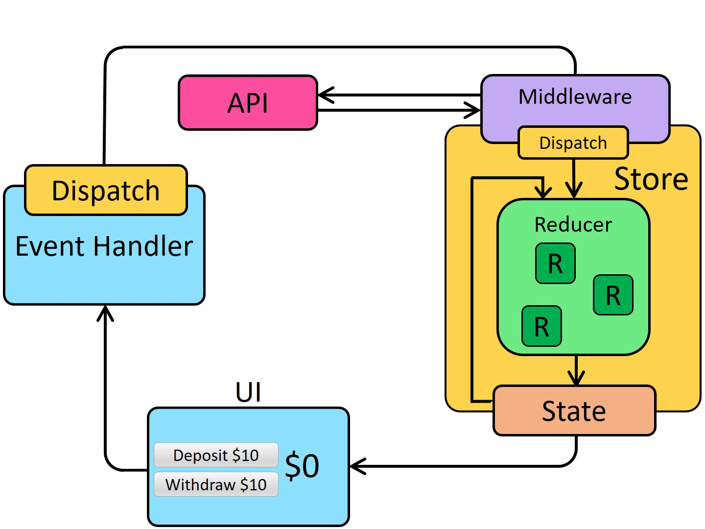

# Episode 12 - Let's build our store

## Redux

Note: Redux is not mandatory

- Alternate of Redux can be
  [zustand](https://www.npmjs.com/package/zustand)

### Why use Redux

1. For making scalable application.
2. Easier to debug application.
3. It offers state management.

Redux offers 2 libraries.

1. React-Redux
2. Redux Toolkit

### why Redux Toolkit was introduced?

1. Configuring Redux store is too complicated.
2. Have to add a lot of packages to do anything useful.
3. Redux requires too much boilerplate code.

## Redux Store

- It acts as a central place.
- We keep most of tehe data into the store.



- We will be dividing the Redux store into logical chunks called <b>slice.</b>

### Write into Redux store slice

- We cannot directly update the Redux slice.
- An event should dispatch an action, which will call a function and the function will modify the Redux slice.
- The function which modifies the Redux slice is known as <b>Reducer.</b>

### Read or Subscribe to Redux store

- We use something known as <b>Selector</b> to read the Redux slice.
- The phenomenon of using the Selector is known as <b>Subscribing to the Slice.</b>

## Redux Setup & Usage

1. Install @reduxjs/toolkit and react-redux packages.

- Run the following commands.

```bash
npm install @reduxjs/toolkit
npm install react-redux
```

2. Configure or Build store.

```javascript
import { configureStore } from "@reduxjs/toolkit";
import cartReducer from "../utils/cartSlice";

const appStore = configureStore({
  reducer: {
    cart: cartReducer,
  },
});

export default appStore;
```

3. Provide the store to the application

- Here I want to provide it to the whole app. Hence the below code.

```jsx
import { Provider } from "react-redux";
import appStore from "./utils/appStore";

<Provider store={appStore}>
  <UserContext.Provider value={{ loggedInUser: username, setUsername }}>
    <div className="root">
      <Header />
      <Outlet />
    </div>
  </UserContext.Provider>
</Provider>;
```

4. Create a Redux Slice.

```javascript
import { createSlice, current } from "@reduxjs/toolkit";

const cartSlice = createSlice({
  name: "cart",
  initialState: {
    items: [],
  },
  reducers: {
    addItem: (state, action) => {
      state.items.push(action.payload);
    },
    removeItem: (state, action) => {
      const currentItems = state.items.filter(
        (item) => item !== action.payload
      );
      return { items: currentItems };
    },
    clearItems: (state) => {
      const currentState = current(state); //See the current state
      console.log(currentState);
      state.items.length = 0;
      // return [];
    },
  },
});

export const { addItem, removeItem, clearItems } = cartSlice.actions;

export default cartSlice.reducer;
```

5. Dispatch an action.

- We need to use useDispatch() hook which is coming from react-redux library.

```javascript
import { useDispatch } from "react-redux";
import { addItem } from "../utils/cartSlice";

const dispatch = useDispatch();

const addItemToCart = (item) => {
  dispatch(addItem(item));
};
```

- useDispatch() will gives us a reducer function. We need to pass or dispatch the appropriate action using the reducer function.

6. Subsrcribe to the slice.

- We need to use useSelector() hook which is coming from react-redux library.

```javascript
import { useDispatch, useSelector } from "react-redux";
import { clearItems } from "../utils/cartSlice";

const cartItems = useSelector((store) => store.cart.items);
```

## Things to keep in mind while using Redux Toolkit

1. Subscribe to the right section of the store. It will increase the performance.
2. Reducer keyword can be tricky. It will be <b>reducer</b> in <b>store</b>, <b>reducers</b> in <b>slice</b>, and <b>reducer</b> while exporting from sclice.
3. In Vallina Redux, we use to create a copy of the state and modify it. Also we would return it explicitly.
4. But in Redux toolkit, we mutate the actual state and will not return explicitly, although we can do it.
5. Redux now uses immer library to create a clone of the object or state internally.
6. If we want to log the current state, use current() function given by react-redux.

```javascript
current(state); //returns current state
```

7. RTK (Redux toolkit) says either mutate the current state OR return the new state.

Note: Redux dev tools are very helpful in debugging and also it simulates the use behaviour.

[Read about RTK Query](https://redux-toolkit.js.org/rtk-query/overview)
